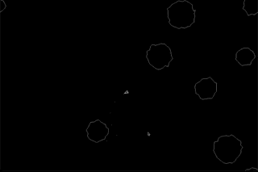

# Asteroids

A simple implementation of the classic asteroids game written in Crystal using SDL2

## Building

- Install SDL2
- run `shards build`

## Contributing

1. Fork it (<https://github.com/your-github-user/asteroids/fork>)
2. Create your feature branch (`git checkout -b my-new-feature`)
3. Commit your changes (`git commit -am 'Add some feature'`)
4. Push to the branch (`git push origin my-new-feature`)
5. Create a new Pull Request

## Contributors

- [Alex Clink](https://github.com/your-github-user) - creator and maintainer
